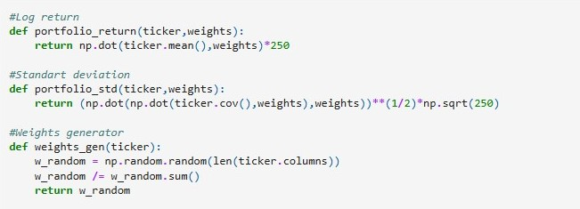

## Idea
Using yfinance we want find the best portfolio given an upper bound risk, and a list of stocks.

## Functions

Basic functions are Log return (**portfolio_return**) , portafolio standart deviation (**std_portfolio**), and a weights random generator (**weights_gen**).
The inputs are **ticker** wich are **yfinance ticker** like "COME.BA" , "BYMA.BA", etc. and **weights** generated by **weights_gen**

Then we construct **frontier** with inputs **stocks** wich are a list of **yfinance tickers** , and **iterations** wich is the number of iterations that our function **weights_gen** will create randoms weights.

The output is a **dataframe** with **Return**, **Risk** for each combination of weights given by **weights_gen** for a particular list of tickers (stocks in our porfolio).

Finally we build **find_best** wich is a function that return the weights compositions with the **best return** given and upper bound **Risk** that we want assume for a set of stocks. The input is the data frame provided by **frontier**

